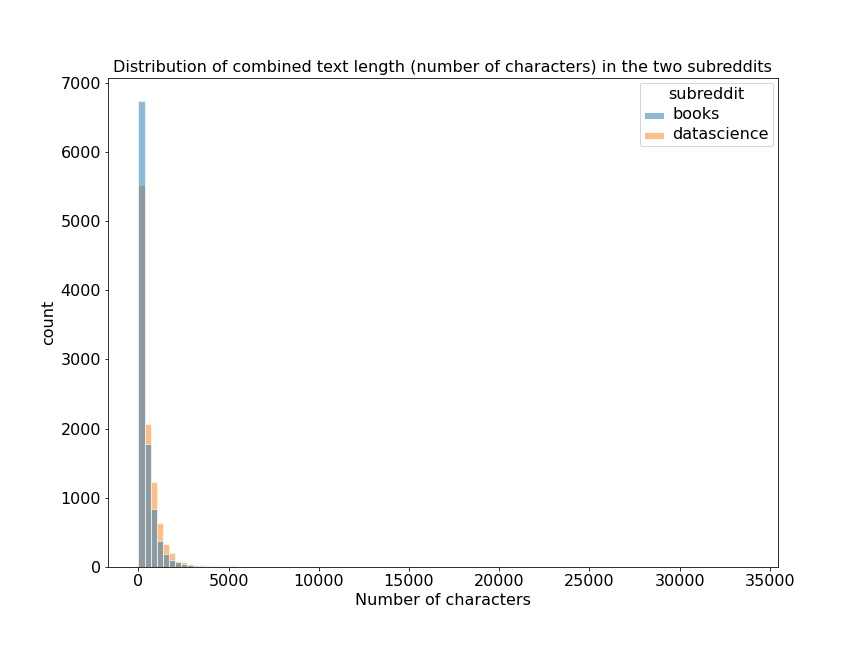
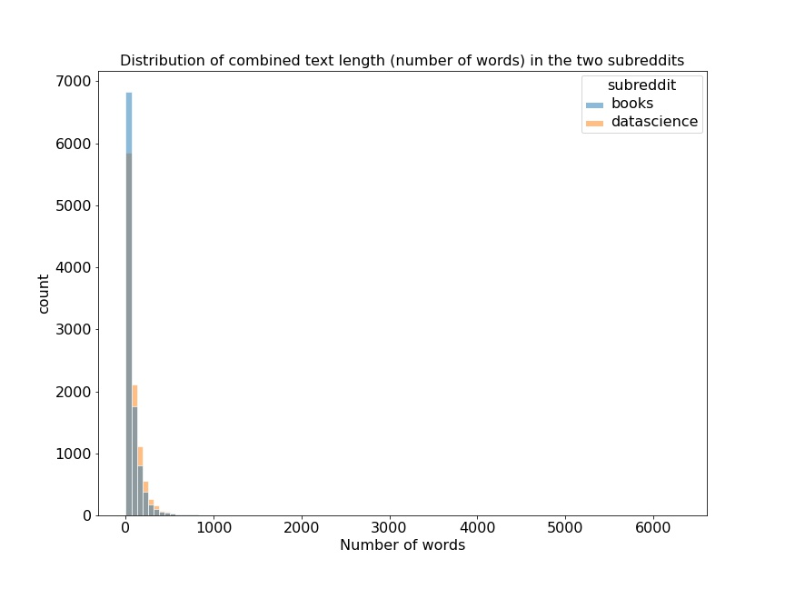
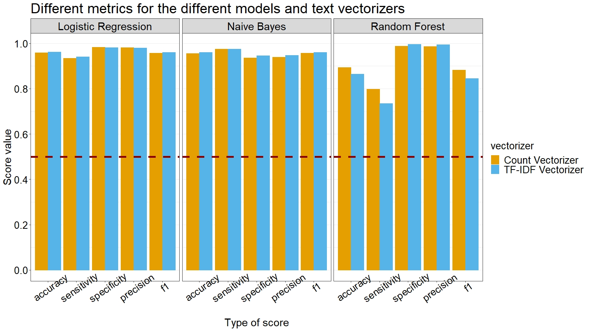
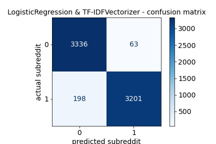
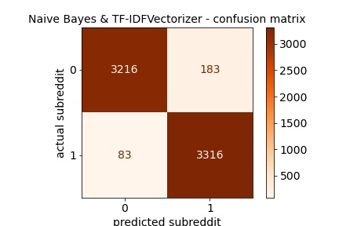
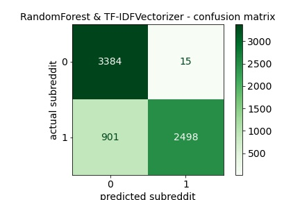
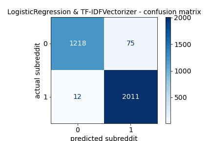
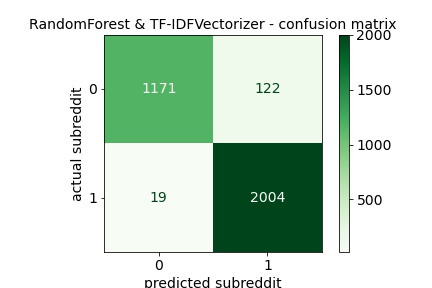
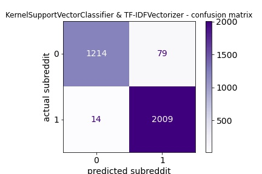

# Classifying Subreddits

---

### Background and Problem Statement

In this project, we will take posts from the [Reddit website](https://www.reddit.com/), specifically from two subreddits on two different topics, [**data science**](https://www.reddit.com/r/datascience/) and [**books**](https://www.reddit.com/r/books/). We will then train a model on the texts in posts from these two subreddits, with the goal of predicting as accurately as possible to which of the two subreddits new posts that the model has not seen before belong. 

This is a binary classification problem, in which the model has to classify an unseen data point as belonging to either **class A** (for our purposes, the <ins>'positive'</ins> class, coded as 1) or **class B** (the <ins>'negative'</ins> class, coded as 0). All the models that we will use in this analysis are capable of doing such a classification task, although they are of different types and they might perform differently; that is, one model might predict more accurately than others, which is why we will try out different models and take as our production model the most accurate model.

Performance of the models is typically evaluated by looking at different metrics:

**Accuracy** --> The percentage of correct predictions overall, whether in class A or class B.

**Sensitivity** --> The percentage of correct predictions in class A.

**Specificity** --> The percentage of correct predictions in class B.

**Precision** --> The percentage of correct predictions out of the total predictions for class A.

**F1 Score** --> Balancing Precision and Sensitivity, minimizing both False Positives (incorrect predictions that a data point is of class A) and False Negatives (incorrect predictions that a data point is in class B). This metric is especially useful when the classes are imbalanced, that is, when we have many more data points in one class as compared to the other.

Since we want to correctly predict the classification into the two subreddits, we do not have a type of error that is less desirable than the other; in other words, we aim at constructing a model that will predict as accurately as possible the classification for the _datascience_ as well as for the _books_ subreddits. Therefore, we might be interested especially in the **Accuracy** score, which gives us information on the overall prediction accuracy of the model, for both classes. We might also look at the **F1 score**, if the classes are imbalanced and we want to minimize both False Positives and False Negatives.

The production model - the best-performing model - can then be used by the administrators of the Reddit website. For example, when a person submits a post for the _books_ subreddit, the model will be able to say whether this post is appropriate for the _books_ subreddit or perhaps it is more suitable for the _datascience_ subreddit. In case of a mismatch (the person submitted the post under _books_ but the model classifies it as _datascience_, or vice versa), an administrator of the website could check the text of the post and decide whether it has been submitted to the right place or not.

---

### Getting the data

To get the posts from the Reddit website, we used the [_Pushshift_](https://github.com/pushshift/api) API, which enables us to access the submissions on Reddit, looking within a particular subreddit. With the Python library [_requests_](https://docs.python-requests.org/en/master/), we pulled from the two subreddits a number of posts from a certain time period.

Since Pushshift allows for a maximum of 100 submission requests at a time, we had to do the data collection in several takes, each time requesting 100 posts for the _data science_ and 100 posts for the _books_ subreddits. 

As for the **time interval** from which the posts were taken, we started on 01/01/2020 and finished on 05/30/2021, with a gap of 4-6 days between one time stamp and another, so that when submitting a new request for 100 posts, we will not receive two identical posts. For instance, if someone posted on the _data science_ subreddit on 01/01/2020 and the next submission was posted two days later, on 01/03/2020, if we request 100 posts in consecutive dates we might run the risk of getting the same posts from 01/01/2020 and from 01/02/2020; this is not very likely, since every day a large number of people post on each subreddit, but in order to be absolutely sure we do not request the same posts, we introduced this 4-6 days gap between the dates from which the submissions were taken.

For each request (containing 100 submissions), we created a data frame that saves the following information per submission: the **title** of the post, the **actual text** contained in the post, the **UTC** time stamp at which it was retrieved, and the **subreddit** from which it was taken.

In total, there were 103 time stamps (date and time), from which 100 submissions were requested from the _data science_ subreddit and 100 submissions from the _books_ subreddit. This resulted in a total of 20,600 documents (posts) in our corpus (entire data frame).

---

### Exploratory Data Analysis and Cleaning

After gathering the data, we checked for missing values. There were no missing values in the titles, but there were **4444 missing values** in the texts, meaning these were posts that contained only a title, without a text. No other column in the data frame contained missing values.

Moreover, there were **6110 posts with a text that has been removed**, marked as '\[removed\]'.

If we were to delete the posts with missing values and the removed posts, we would remain with **10,046 observations** in our data set, and we would be able to train the model on the text of the posts, but then we would lose about half of the data. Alternatively, we could keep all the data and train the model only on the text in the titles.

A third method is to combine the title and the text into one string of text, and train the model on that combined string. We will start out by using this third method. To this end, we created a new column in the data frame that contains the combined text of the post itself and the text of the title together.

The average length of the text for the subreddit _books_ is 69.51 words or 391.66 characters. For the subreddit _datascience_, the average length of the text is 84.76 words or 512.51 characters.

Here is the distribution of the **character count** in the combined text:

And here is the distribution of the **word count** in the combined text:

The following table summarizes some of the information concerning the distribution of the text length in the _books_ subreddit:

||Mean|Standard Deviation|Min|Max|
|---|---|---|---|---|
|word count|69.51|155.51 |1 |6294 |
|character count|391.66 |896.59 |2 |33742 |

The next table summarizes the same information for the _datascience_ subreddit:

||Mean|Standard Deviation|Min|Max|
|---|---|---|---|---|
|word count|84.76| 121.79|1|2166 |
|character count|512.51 |748.89 |3 |14633 |

Overall, we see that the longest texts are in the _books_ subreddit, although on average, the texts in the _datascience_ subreddit are longer. There are few texts that can be considered outliers in terms of their length. For instance, there are texts with as many as 33,742 characters or 6294 words. 

So the question is whether the difference in text length between the two subreddits matter. Could the model use the information about the length to predict the subreddit? Maybe it could, but we would probably not want it to. First of all, in this problem we are interested in _what_ words predict subreddit classification, rather than _how many_ of them do. Second, imagine that someone wants to submit a post to the _datascience_ subreddit that is 100,000 characters long. We do not want the model to tell us the post belongs to the _books_ subreddit only because it is longer; we want to evaluate the content of the post in order to classify it to the right subreddit. For this reason, we will not exclude outlying data points with very long or very short texts.

--

Let us now have a look at the most common tri-grams from the two subreddits.

20 most common tri-grams from the **_books_** subreddit:

||tri-gram|occurrences|
|---|---|---|
|1|of the book         |  403|
|2|one of the          |  302|
|3|what do you         |  218|
|4|do you think        |  204|
|5|in the book         |  187|
|6|the book is         |  167|
|7|some of the         |  166|
|8|at the end          |  164|
|9|www youtube com     |  151|
|10|https www youtube   |  151|
|11|the end of          |  150|
|12|the book and        |  145|
|13|how do you          |  141|
|14|youtube com watch   |  140|
|15|this book is       |   139|
|16|want to read      |    139|
|17|the first book    |    137|
|18|wikipedia org wiki|    135|
|19|the first time|        132|
|20|the book was|          121|

20 most common tri-grams from the **_datascience_** subreddit:

||tri-gram|occurrences|
|---|---|---|
|1|in data science     | 1048|
|2|for data science    |  507|
|3|data science and    |  483|
|4|of data science     |  402|
|5|would like to       |  376|
|6|to data science     |  337|
|7|the data science    |  334|
|8|be able to          |  277|
|9|as data scientist   |  270|
|10|into data science   |  245|
|11|https github com    |  235|
|12|do you think        |  212|
|13|thanks in advance   |  200|
|14|what are the        |  199|
|15|www reddit com      |  197|
|16|https www reddit    |  197|
|17|how do you          |  195|
|18|what is the        |   192|
|19|and data science  |    192|
|20|on how to  |           181|

Different words / combinations of words / expressions clearly appear in each of the two subreddits that we have picked. Unsurprisingly, words like 'book' and 'read' are repeated in different combinations throughout the 20 most common tri-grams in the _books_ subreddit; in the _datascience_ subreddit, words like 'data', 'science' and 'scientist' are highly common. 

We might conclude from these lists of tri-grams that the two subreddits differ substantially in terms of the texts that are posted in them, meaning our model should have an easy task classifying correctly unseen posts. Thus, our goal is to reach a high level of performance of the models, minimizing as much as possible the wrong predictions, that is, the rate of False Positives (wrongly predicting that a post belongs to _datascience_ when in fact the post belongs to _books_) and False Negatives (wrongly predicting that a post belongs to _books_ when it actually should be under _datascience_).

---

### Modeling

Before fitting a model, we need to calculate the **baseline accuracy score**, that is, the percentage of accurately predicting the majority class in our data. In the case of our data, the baseline score is **50%**; in other words, we have exactly the same number of posts classified under _books_ and of posts classified under _datascience_. At the very minimum, our model will have to perform better than the baseline score.

We fit 3 types of models: **Logistic Regression**, **Naive Bayes** and **Random Forest**. Each model was fit twice with two different text vectorizers (the operator that transforms the text into numeric columns that can be put into the model): once with **Count Vectorizer** and once with **TF-IDF Vectorizer**. Crossing the three types of models with the two types of vectorizers yielded 6 models in total.

For each model, we split the data between a **Training Set** (containing 2/3 of the data, or 13,802 documents) on which the model was trained, and a **Testing Set** (the remaining 1/3 of the data, or 6798 documents). The latter serves as an unseen data set on which to test the model and see whether it correctly predicts the classification of subreddits.

Next, we set up for each model a pipeline with 2 steps:

1) Applying one of the two text vectorizers and transforming the text into sparse matrix on which to fit the model. 

2) Fitting one of the three kinds of models.

When working on each model, we tried out different combinations of hyperparameters and tuned them repeatedly until we settled on those that yielded a model with the highest score possible. The final version of the best performing model among the six model will be our _production model_.

--

#### First model type: **Logistic Regression**

The first two models that we fit were a Logistic Regression. The model's best hyperparameters were `penalty = 'l2'` (type of regularization) and `C = 1` (how much regularization). The best hyperparameters for the Count Vectorizer were: `max_features = 8000`, `max_df = 0.5`, `min_df = 3`, `ngram_range = (1,1)`. 

Train accuracy score: 0.986

Test accuracy score: 0.958

With the TF-IDF Vectorizer, the hyperparameters were almost the same except for two hyperparameters in the vectorizer: `max_features = 9000` and `min_df = 2`.

Train accuracy score: 0.978

Test accuracy score: 0.961

--

#### Second model type: **Naive Bayes**

The next two models that we fit were Naive Bayes models. We tuned the hyperparameters of the Count Vectorizer, yielding the best performing model with: `max_features = 9000`, `max_df = 0.4`, `min_df = 4`, `ngram_range = (1,1)`.

Train accuracy score = 0.960

Test accuracy score = 0.955

For the TF-IDF Vectorizer, the hyperparameters that gave the model with the highest accuracy were: `max_features = 9000`, `max_df = 0.6`, `min_df = 3`, `ngram_range = (1,1)`.

Train accuracy score = 0.968

Test accuracy score = 0.960

--

#### Third model type: **Random Forest**

The last model type we fit was Random Forest. The hyperparameters for the Count Vectorizer were as follows: `max_features = 6000`, `max_df = 0.4`, `min_df = 4`, `ngram_range = (1,1)`. The best hyperparameters for the model itself were: `n_estimators = 50`, `max_depth = 7`, `min_samples_split = 2`, `ccp_alpha = 0.01`.

Train accuracy score = 0.896

Test accuracy score = 0.893

The best hyperparameters for the TF-IDF Vectorizer were: `max_features = 7000`, `max_df = 0.4`, `min_df = 4`, `ngram_range = (1,1)`. For the model itself, the final hyperparameters were: `n_estimators = 70`, `max_depth = 7`, `min_samples_split = 3`, `ccp_alpha = 0.01`.

Train accuracy score = 0.870

Test accuracy score = 0.865

--

The following plot shows the various metrics (calculated on the testing data set) for the 3 models and the 2 text vectorizers (the horizontal dashed line, at 0.5, marks the baseline accuracy score).

The same information from the plot is also summarized in the following table:

|Vectorizer|Model|Accuracy training|Accuracy testing|Sensitivity|Specificity|Precision|F1 score|
|---|---|---|---|---|---|---|---|
|Count|Logistic Regression|0.986|0.958|0.934|0.982|0.981|0.957|
|Count|Naive Bayes|0.960|0.955|0.975|0.936|0.938|0.956|
|Count|Random Forest|0.896|0.893|0.799|0.988|0.986|0.882|
|TF-IDF|Logistic Regression|0.978|0.961|0.941|0.981|0.980|0.960|
|TF-IDF|Naive Bayes|0.968|0.960|0.975|0.946|0.947|0.961|
|TF-IDF|Random Forest|0.870|0.865|0.734|0.995|0.994|0.845|

Since in this problem we are interested in predicting correct classification both for the _datascience_ (positive class) and for the _books_ (negative class) subreddits, the most important model metric is probably Accuracy (defined as the proportion of observations correctly predicted) or the F1 Score (which balances Precision and Sensitivity, reducing both False Positives and False Negatives). Note that in other classification problems different metrics may be more important than Accuracy. For instance, when trying to predict whether a person has a heart disease, a False Negative error type (mistakenly classifying someone as healthy when in reality they have a heart disease) might be significantly more crucial to detect and reduce than a False Positive error (mistakenly predicting that someone has a heart disease when in fact they are healthy). But again, we want our model here to correctly classify posts as belonging to the two subreddits, and to a similar extent. Thus, looking at the total correct predictions in either subreddit (Accuracy) and the reduction of both types of error (F1 Score) are probably more important for the specific problem we are facing.

---

### Interpretation of the results

The first thing to point out about the results, is that using a Count vs. a TF-IDF Vectorizer did not affect much model performance, except for some scores of the Random Forest model for which the Count Vectorizer yielded better performance.

In terms of the model metrics that are important for our purposes - Accuracy and F1 score - the model that performed worse of all is Random Forest. Besides having the lowest Accuracy and F1 scores, it also had the lowest Sensitivity score, given that it had a big number of False Negatives (900).

By contrast, both the Naive Bayes model and the Logistic Regression model performed pretty well in terms of Accuracy and F1 Score. 

Below are three plots showing the _confusion matrix_ with the 4 categories of predicted vs. actual classification: _True Negatives_ (in the plot, the cell marked as actual 0 ; predicted 0), _True Positives_ (actual 1 ; predicted 1), _False Negatives_ (actual 1 ; predicted 0) and _False Positives_ (actual 0 ; predicted 1).

The first confusion matrix is of the Logistic Regression model with TF-IDF Vectorizer:

The second confusion matrix is of the Naive Bayes model with TF-IDF Vectorizer:

The third confusion matrix plot is of the Random Forest model with TF-IDF Vectorizer:

Interestingly, the Logistic Regression and the Naive Bayes models had an opposite pattern in terms of Sensitivity and Specificity. The Logistic Regression model had more False Negatives but fewer False Positives than the Naive Bayes model, resulting in a lower Sensitivity score and a higher Specificity score. The opposite pattern was observed in the Naive Bayes model, which had more False Positives than False Negatives (higher Sensitivity and lower Specificity).

---

### Modeling once more - taking only the post's text without the title

One of the possibilities of how to deal with the missing values and the removed posts was to discard these documents from the corpus, and train the model on the text of the post in the remaining documents, without the title. 

Following several rounds of playing around with the modeling and trying out different possibilities, it turned out that doing this increased the performance of the models, despite the fact that we got rid of thousands of posts on which the models could have been trained. This might suggest that the actual content of the post in the _datascience_ and _books_ subreddits is more informative than the title when predicting the subreddit to which the post belongs. In fact, it seems that taking into account the text in the title reduces (even if slightly) the models' ability to predict the correct subreddit.

In the following, we will present the results from 3 additional models that were trained on the 10,046 posts containing only the text without the title (and again, without the comments). The three models were: **Logistic Regression**, **Random Forest** and, differently from what we did previously, a **Kernel Support Vector Classifier** (we did not try out the Naive Bayes model on this subsetted data, because we have seen earlier that its performance did not change much from that of the Logistic Regression; in fact, the latter was slightly better than the former).

In this round of model fitting, we only used the TF-IDF Vectorizer.

In this subsetted data, we did not have the same number of posts in the two subreddits. The **baseline score** here was **61%** accuracy in predicting the _datascience_ subreddit (the majority class in the data).

--

Let us look at the model results.

**Logistic Regression** - Hyperparameters for the vectorizer: `max_features = 6000`, `max_df = 0.5`, `min_df = 2`, `ngram_range = (1,1)`. Hyperparameters for the model: `penalty = 'l2'`, `C = 20`.

Train accuracy score = 0.991

Test accuracy score = 0.973

--

**Random Forest** - Hyperparameters for the vectorizer: `max_features = 300`, `max_df = 0.7`, `min_df = 7`, `ngram_range = (1,1)`. Hyperparameters for the model: `n_estimators = 200`, `ccp_alpha = 0.01`, `max_depth = 15`, `min_samples_split = 2`.

Train accuracy score = 0.954

Test accuracy score = 0.957

--

**Kernel Vector Support Classifier** - Hyperparameters for the vectorizer: `max_features = 3000`, `max_df = 0.7`, `min_df = 5`, `ngram_range = (1,1)`. Hyperparameters for the model: `C = 1.5`, `kernel = 'rbf'`.

Train accuracy score = 0.991

Test accuracy score = 0.971

-- 

The following table summarizes various metrics for these 3 models:

|Model|Accuracy training|Accuracy testing|Sensitivity|Specificity|Precision|F1 score|
|---|---|---|---|---|---|---|
|Logistic Regression|0.991|0.973|0.994|0.941|0.964|0.978|
|Random Forest|0.954|0.957|0.990|0.905|0.942|0.966|
|Kernel Vector Support Classifier|0.991|0.971|0.993|0.938|0.962|0.977|

--

Interpretation of the results:

Subsetting the data by removing all the missing values and the posts with removed text improved the ability of the models to predict the subreddits. Most notably, the Random Forest model improved its performance a lot. The model that we added, the Kernel Vector Support Classifier, performed similarly to the Logistic Regression model.

Here is the confusion matrix for the Logistic Regression model on the subsetted data:

Here is the confusion matrix for the Random Forest model on the subsetted data:

And lastly, the confusion matrix plot for the Kernel Support Vector Classifier:

From the confusion matrices we can clearly see the improved performance of the Logistic Regression model, where the number of False Negatives decreased drastically when trained only on the post text. Also the Random Forest model's improved performance can be observed: the number of False Negatives decrease drammatically (from 901 to 19), although the number of False Positives increased in this model. As for the Kernel SVC model, it performed almost identically to the Logistic Regression model.

---

### Conclusions

The final model that we propose as the **production model** is the one that performed with the highest Accuracy / F1 Score. The **Logistic Regression** model trained on the **text-only** part of the post (without the title) with a TF-IDF Vectorizer had the highest Accuracy Score and the highest F1 Score. It performed only slightly better than the Kernel Support Vector Classifier - in fact they were virtually identical in terms of metrics - but since we want to recommend only one model, we will opt for the model that the numbers indicate as the best performing model.

The model can be used by the Reddit website administrators / moderators in order to classify newly submitted posts to the subreddits _datascience_ and _books_. In an ongoing process of evaluation, our production model can take as unseen data posts that Reddit users submit, for instance, to the _books_ subreddit. It can then produce a prediction whether the post is suitable for the _books_ subreddit or rather whether it is more suitable for the _datascience_ subreddit. If it classifies the post under _books_, then it can be published on that subreddit; otherwise, an administrator / moderator might check manually the post and see whether it is better suited for the _datascience_ subreddit like the model predicted. 

Note that, based on the analysis we performed, only the text of the post needs to be fed to the model as data on which to predict, without the title. 

### Next steps

The analysis presented in this project is by no means conclusive, and it can be extended and/or improved in various ways. Here are some possible ideas:

* One recommended thing to do is to try and include also the length of the post as a predictor in the model. This way, the model could account for the different post lengths when classifying which post belongs to which subreddit (for instance, there might be subreddits where the posts tend to be significantly longer than others, as we have seen in the current analysis).

* Another thing to do is try and reduce the variance in the production model that we propose. Although it is a highly performing model, it is still somewhat overfit, in that its accuracy score on the testing set (0.97) is slightly lower than its accuracy score on the training set (0.99). It might be necessary to keep tuning and trying out different combinations of hyperparameters in order to achieve the desired accuracy score on the testing data.

* Finally, it would be interesting and useful to extend the model into a larger series of models that compare not only two subreddits, but several of them, in order to classify an incoming new post as belonging to one of the many subreddits that exist on the Reddit website.

---